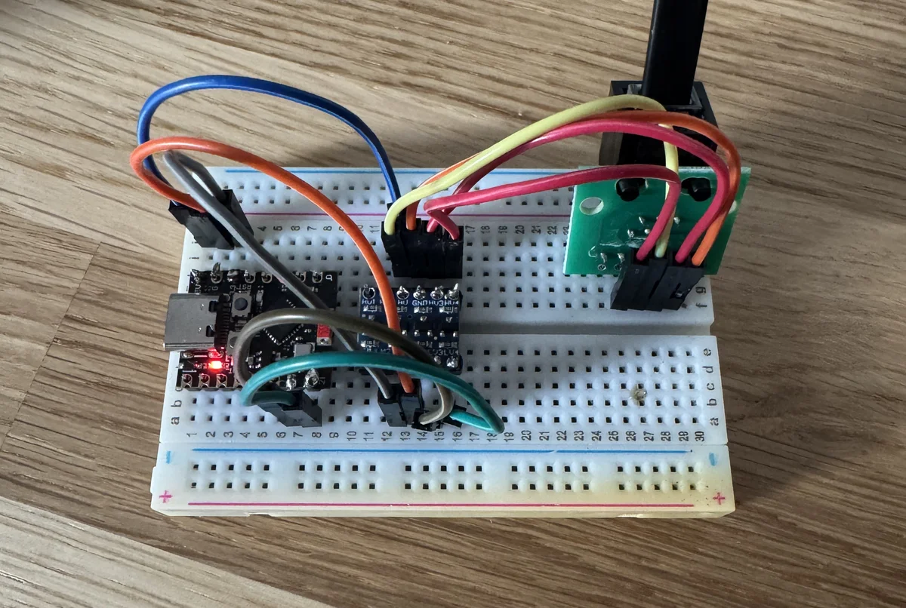

# esphome-desktronic-homemax

An [ESPHome](https://esphome.io) component for **Desktronic HomeMax** standing desks. It connects an ESP32 to the desk controller's RJ12 port so you can control the desk from Home Assistant: move it, go to a specific height, use and save memory positions, and track how much you stand.

The HomeMax uses a Jiecang controller that talks serial (UART) at 9600 baud. This component was written and tested on a HomeMax with an ESP32-C3 Super Mini.

## Features

- **Height sensor**, updated whenever the desk moves, including when you use the handset
- **Height range read from the controller**, including user height limits, plus height in percent
- **Move up / Move down / Stop** buttons: the desk moves all the way until it reaches the end or you press Stop
- **Go to height**: type a height in cm and the controller moves the desk there by itself
- **Up 1 cm / Down 1 cm** buttons for fine adjustment
- **Preset selector**: named heights like "Sit" and "Stand" in a dropdown, which also shows the preset the desk is at
- **Memory positions 1–4**: go to them, see their stored heights, save the current height, or set a new height directly. The HomeMax handset only has buttons for 1 and 2, but the controller stores four.
- **User height limits** from Home Assistant: set the current height as the minimum or maximum, or clear them
- **Cover entity**: the desk shows up like a blind in Home Assistant, with a 0–100% slider and voice assistant support
- **Moving** and **Standing** binary sensors
- **Standing time today** in minutes
- **Controller connected** sensor, so a loose cable is easy to spot
- Lambda functions for your own automations, such as `id(desk).goto_height(80);`

## Hardware

You need:

- An ESP32 board. The example uses an **ESP32-C3 Super Mini**, but any ESP32 with a free UART works.
- A **bidirectional logic level converter** (3.3 V ↔ 5 V), for example a 4-channel BSS138 module. The desk uses 5 V logic and the ESP32 uses 3.3 V, so don't connect them directly.
- An **RJ12 breakout board** or a cut RJ12 cable to reach the controller's pins.

The desk's RJ12 port supplies enough power for the ESP32-C3, including WiFi, so no separate power supply is needed.

### Wiring

| RJ12 (controller) | Level converter | ESP32-C3 Super Mini |
|---|---|---|
| Pin 2 (GND) | GND (HV and LV side) | G |
| Pin 3 (controller TX) | HV3 → LV3 | GPIO 20 (RX) |
| Pin 4 (VCC) | HV | 5V |
| Pin 5 (controller RX) | HV4 → LV4 | GPIO 21 (TX) |
| | LV | 3V3 |

All grounds must be connected together: RJ12 Pin 2, both GND pins of the level converter, and the ESP32's G pin. The level converter's HV side is connected to RJ12 Pin 4 and the ESP32's 5V pin, and the LV side gets 3.3 V from the 3V3 pin.

Keep the power wires (Pin 2 and Pin 4) short and soldered. WiFi draws short current spikes, and the resistance of breadboard contacts and long jumper wires can make the voltage dip enough to reset the ESP32.

> **Check your pins with a multimeter before connecting anything.** Pin numbering depends on which way you count, and other controller models may differ. With the controller powered, the controller's TX pin sits near 5 V and flickers while the desk moves. Never connect the level converter to a pin that carries more than 5 V.



## Installation

Add the component to your ESPHome config:

```yaml
external_components:
  - source:
      type: git
      url: https://github.com/sebastianlivoni/esphome-desktronic-homemax
    components: [ homemax_desk ]

uart:
  id: uart_bus
  tx_pin: GPIO21
  rx_pin: GPIO20
  baud_rate: 9600

homemax_desk:
  id: desk
  height:
    name: "Height"
  move_up:
    name: "Move up"
  move_down:
    name: "Move down"
  stop:
    name: "Stop"
```

A complete example with every feature is in [`desktronic-homemax.yaml`](desktronic-homemax.yaml). The same example with Danish entity names is in [`desktronic-homemax.da.yaml`](desktronic-homemax.da.yaml). Both expect a `secrets.yaml` next to them:

```yaml
wifi_ssid: "your-wifi"
wifi_password: "your-password"
ap_password: "fallback-hotspot-password"
web_username: "admin"
web_password: "password-for-the-web-page"
api_key: "generate one at https://esphome.io/components/api.html"
```

On an ESP32-C3, keep logging on USB so it doesn't interfere with the desk's UART:

```yaml
logger:
  hardware_uart: USB_SERIAL_JTAG
```

## Configuration

Every entity is optional. Add only the ones you want.

### Entities

| Key | Type | Description |
|---|---|---|
| `height` | sensor | Current height in cm |
| `height_percent` | sensor | Height in % of the desk's range |
| `height_min`, `height_max` | sensor | Usable height range: the user limits where set, otherwise the physical range |
| `user_height_min`, `user_height_max` | sensor | User height limits (empty if not set) |
| `set_user_height_min`, `set_user_height_max` | button | Use the current height as the user minimum / maximum |
| `clear_user_height_min`, `clear_user_height_max` | button | Remove the user minimum / maximum |
| `move_up` | button | Move all the way up, until the top or Stop |
| `move_down` | button | Move all the way down, until the bottom or Stop |
| `stop` | button | Stop any movement |
| `nudge_up`, `nudge_down` | button | Move up or down by `nudge_step` |
| `target_height` | number | Move to a height in cm |
| `preset` | select | Named height presets (see [Presets](#presets)) |
| `cover` | cover | The desk as a cover: 0% = `min_height`, 100% = `max_height` |
| `position1` … `position4` | button | Go to memory position 1–4 |
| `position1_height` … `position4_height` | sensor | Stored height of memory position 1–4 (empty if not set) |
| `save_position1` … `save_position4` | button | Save the current height as position 1–4 |
| `set_position1` … `set_position4` | number | Move to a height, then save it as position 1–4 |
| `refresh_positions` | button | Ask the controller for the stored positions |
| `moving` | binary sensor | On while the desk is moving |
| `standing` | binary sensor | On at or above `standing_height` |
| `standing_time` | sensor | Minutes spent standing since the last reset |
| `controller_connected` | binary sensor | Off when the controller stops answering |

### Settings

| Key | Default | Description |
|---|---|---|
| `auto_limits` | `true` | Read the height range and user limits from the controller |
| `min_height` | `50` | Lowest height in cm, used until the controller reports its range (or always, with `auto_limits: false`) |
| `max_height` | `140` | Highest height in cm, as above |
| `standing_height` | `95` | Height in cm from which you count as standing |
| `nudge_step` | `1` | How many cm `nudge_up` / `nudge_down` move per press (0.1–10) |
| `poll_interval` | `60s` | How often to read the user limits while idle, which also checks that the controller answers. `0s` turns it off. |
| `position1_command` … `position4_command` | `0x05`, `0x06`, `0x27`, `0x28` | Command bytes for going to a memory position |
| `save_position1_command` … `save_position4_command` | `0x03`, `0x04`, `0x25`, `0x26` | Command bytes for saving a memory position |
| `position1_report` … `position4_report` | `0x25` … `0x28` | Message types the controller uses to report stored positions |
| `set_user_max_command`, `set_user_min_command` | `0x21`, `0x22` | Command bytes for setting the user limits |
| `clear_user_limit_command` | `0x23` | Command byte for clearing a user limit (sent with `0x01` = maximum, `0x02` = minimum) |

With `auto_limits`, the component asks the controller for its height range and uses it for the cover, the percentage and the go-to-height limits. If a user height limit is set (for example so the desk never goes below 80 cm), that limit replaces the physical one on that side. The component reads the user limits every `poll_interval`, so a change on the handset shows up within a minute. The number sliders in Home Assistant pick up the new range the next time Home Assistant connects to the device, for example after a restart. Set `min_height` and `max_height` to your desk's range anyway, so the sliders are right from the start. On the HomeMax that's 75–119 cm.

### Presets

A dropdown with named heights. Choosing a preset moves the desk there. When the desk stops, the dropdown shows the preset it's at (within 1 cm), or the `other_option` when it's at none of them:

```yaml
homemax_desk:
  preset:
    name: "Desk Preset"
    presets:
      - name: "Sit"
        height: 75
      - name: "Stand"
        height: 110
      - name: "Typing"
        height: 72
    other_option: "Other"   # default
```

Preset names must be unique, and none may be called like the `other_option`.

### Setting user limits

With the user limits, the controller never moves the desk below the minimum or above the maximum, including with the handset. To set one, move the desk to the height you want, for example with Target Height, then press **Set Current as User Max** or **Set Current as User Min**. The User Height Min / Max sensors update a moment later.

To go past a limit again, clear it first with **Clear User Max** or **Clear User Min**. A limit can also always be removed with the handset, as described in your desk's manual.

### Resetting the standing time

The standing time counts up until you reset it. To reset it every night, use a time source:

```yaml
time:
  - platform: homeassistant
    on_time:
      - seconds: 0
        minutes: 0
        hours: 0
        then:
          - lambda: "id(desk).reset_standing_time();"
```

The counter isn't saved across restarts.

### Diagnostics

`controller_connected` checks that the controller still answers. While the desk is idle, the component reads the user limits (`0x20`) every `poll_interval`. If there's no answer, the sensor turns off.

### Web page

With ESPHome's `web_server`, the ESP32 serves its own control page at `http://<name>.local` (or its IP address), which works without Home Assistant. Protect it with a password, otherwise anyone on your network can move the desk:

```yaml
web_server:
  port: 80
  version: 3
  auth:
    username: !secret web_username
    password: !secret web_password
```

## Lambda functions

For template buttons, scripts, and automations:

| Function | Description |
|---|---|
| `id(desk).move_up()` / `move_down()` | Move all the way up / down |
| `id(desk).stop()` | Stop any movement |
| `id(desk).goto_height(80)` | Move to 80 cm |
| `id(desk).nudge(2.5)` | Move up 2.5 cm (negative values move down) |
| `id(desk).goto_position(1)` | Go to memory position 1–4 |
| `id(desk).save_position(1)` | Save the current height as position 1–4 |
| `id(desk).set_position_height(1, 110)` | Move to 110 cm and save it as position 1 |
| `id(desk).set_user_max()` / `set_user_min()` | Use the current height as the user maximum / minimum |
| `id(desk).clear_user_max()` / `clear_user_min()` | Remove the user maximum / minimum |
| `id(desk).request_settings()` | Ask the controller for the stored positions and height range |
| `id(desk).reset_standing_time()` | Reset the standing time |
| `id(desk).send_command(0x05)` | Send any single-byte command: `F1 F1 <cmd> 00 <cmd> 7E` |
| `id(desk).send_command(0x23, 0x01)` | Send a command with one data byte: `F1 F1 <cmd> 01 <data> <cs> 7E` |
| `id(desk).get_height()` | Current height in cm, `NAN` if unknown |
| `id(desk).get_height_percent()` | Height in % of the range, `NAN` if unknown |
| `id(desk).get_min_height()` / `get_max_height()` | Usable height range in cm, including user limits |
| `id(desk).is_moving()` | `true` while the desk moves |
| `id(desk).is_standing()` | `true` at or above `standing_height` |
| `id(desk).is_connected()` | `true` while the controller answers |
| `id(desk).get_standing_minutes()` | Standing time since the last reset |

## How it works

### Protocol

Messages from the ESP32 to the controller:

```
F1 F1 <command> <length> <data...> <checksum> 7E
```

Messages from the controller:

```
F2 F2 <type> <length> <data...> <checksum> 7E
```

The checksum is the sum of the command or type byte, the length byte, and all data bytes, truncated to one byte.

The controller reports the current height while the desk moves, and stays silent when it's idle:

```
F2 F2 01 03 02 EE 07 FB 7E
         │  │  └─┴── height in mm: 0x02EE = 750 = 75.0 cm
         │  └─────── 3 data bytes
         └────────── type 0x01: current height
```

### Moving the desk

The controller has a go-to-height command:

```
F1 F1 1B 02 HH LL CS 7E     (height in mm, e.g. 03 20 = 80.0 cm)
```

With it, the controller moves the desk to the height by itself and stops there. Target Height, Set Position, the presets, the cover and the lambda `goto_height()` all use it. Move up and Move down send it with the top or bottom of the usable range, so the desk moves all the way until it gets there or you press Stop. The component only watches the height reports to know when the desk has arrived. As a safety net, it sends Stop if a move takes longer than 60 seconds.

The plain Up (`0x01`) and Down (`0x02`) commands work differently: the controller only keeps moving while they keep arriving, like holding a handset button, and a single command barely moves the desk. The component doesn't use them.

Because the controller is silent when idle, the component doesn't know the height right after startup. It learns it as soon as the desk moves.

### Verified commands

Verified on a Desktronic HomeMax:

| Direction | Bytes | Meaning |
|---|---|---|
| to controller | `0x01`, `0x02`, `0x2B` | Up, Down, Stop |
| to controller | `0x1B` + 2 bytes | Go to height (mm) |
| to controller | `0x05`, `0x06`, `0x27`, `0x28` | Go to position 1, 2, 3, 4 |
| to controller | `0x03`, `0x04`, `0x25`, `0x26` | Save current height as position 1, 2, 3, 4 |
| to controller | `0x07` | Request stored positions |
| to controller | `0x0C` | Request physical height limits |
| to controller | `0x20` | Request user limits |
| from controller | type `0x01` | Current height |
| from controller | type `0x07`, 4 bytes | Height range: max (2 bytes), min (2 bytes). HomeMax: `04 A6 02 EE` = 119.0 / 75.0 cm |
| from controller | type `0x20`, 1 byte | User limits set: low nibble = maximum, high nibble = minimum (`00` = none) |
| from controller | types `0x21`, `0x22` | User maximum and minimum height |
| from controller | types `0x25`, `0x26`, `0x27`, `0x28` | Stored positions 1–4 (`00 00` = not set) |

Note that some bytes mean different things depending on the direction: sent to the controller, `0x25` and `0x26` save positions 3 and 4; received from it, they report positions 1 and 2.

Not verified yet, which is why they can be changed in the config:

| Direction | Bytes | Meaning |
|---|---|---|
| to controller | `0x21`, `0x22` | Set the current height as user maximum / minimum |
| to controller | `0x23` + `0x01` / `0x02` | Clear the user maximum / minimum |

Other Jiecang controllers may use different bytes, which is why the position and user limit commands can be changed in the config. The component logs every message it doesn't recognize at DEBUG level, for example `Message type 0x25, 2 bytes: 02 EE`. That's the easiest way to find the right values for your controller.

## Troubleshooting

**The Height sensor stays empty.** The controller only reports while the desk moves. Move it once with the handset. If it's still empty, the controller's TX line isn't reaching the ESP32's RX pin: check the wiring, the shared ground, and whether TX and RX are swapped.

**Height works, but the desk doesn't move.** The ESP32's TX line isn't reaching the controller's RX pin. Check that wire, and try swapping the two data wires on the level converter. This component needs a controller that supports go-to-height (`0x1B`). To test it, send `F1 F1 1B 02 03 20 40 7E` (go to 80 cm) with a template button and `uart.write`.

**The ESP32 restarts or WiFi doesn't connect on desk power.** The desk's port supplies enough power, but WiFi draws short current spikes, and resistance in the wiring makes the voltage dip. Keep the power wires short and soldered instead of using a breadboard. If that isn't enough, add a 470–1000 µF electrolytic capacitor (rated 10 V or more) between the ESP32's 5V and G pins, as close to the board as possible, with the minus side (stripe) on G. Lowering `output_power` under `wifi:` also reduces the spikes.

**WiFi is unreliable.** Many ESP32-C3 Super Mini boards have a poorly matched antenna. `output_power: 8.5dB` under `wifi:` often helps.

**Controller Connected is off.** The controller doesn't answer requests. Check the TX wire (ESP32 → controller RX) and the shared ground. If everything else works, set `poll_interval: 0s` to turn the check off.

**Memory positions don't work.** Your controller may use different command bytes. Watch the DEBUG log for unrecognized messages, or see [Verified commands](#verified-commands).

## Acknowledgements

Protocol knowledge builds on the community's work on Jiecang controllers, including [Rocka84's ESPHome components](https://github.com/Rocka84/esphome_components).

## Disclaimer

This project isn't affiliated with Desktronic or Jiecang. Connecting anything to your desk's controller is at your own risk. Keep the area around the desk clear when testing movement commands.

## License

Public domain, released under [The Unlicense](LICENSE). Use it, copy it, change it, sell it: do whatever you want, no credit needed.
